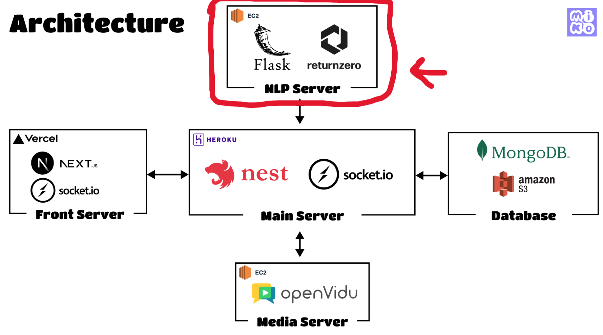
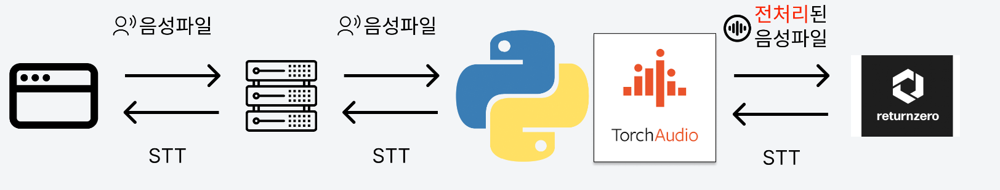
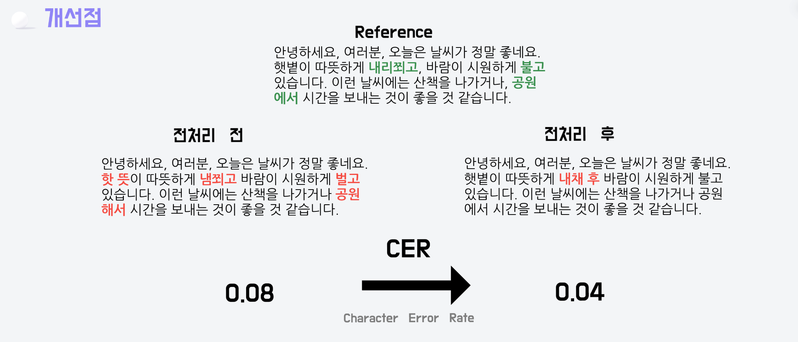

작성일: 2023-07-22
작성자: 안태리

# nlp-server
MIKO 서비스의 자연어 처리 서버

음성파일을 텍스트로 변환하고, 텍스트를 분석하여 키워드를 추출하고, 회의록을 요약하는 서비스를 제공합니다.

Flask로 구현되어있음.

---
# MIKO 아키텍처


---
# nlp-server 기능
1. stt 서비스
2. 키워드 추출 서비스
3. 회의록 요약 서비스
4. gpt 비용 계산


## 1. stt 서비스 (Speech to Text)
`stt` 디렉토리

음성파일을 텍스트로 변환하는 서비스입니다.

main server로부터 webm 형식의 음성파일을 받아 ffmpeg로 wav로 변환함.(8khz, mono)
오디오 전처리 과정을 거치고 리턴제로 api 서비스로 wav 파일을 전송함.
stt 결과를 받아옴.


### 📃리턴제로 spec
동시에 10개 요청 처리 가능.
변환결과를 polling 으로 확인해야함. (polling 주기가 짧아 자주 요청시 간헐적으로 429 에러를 받음)

> **리턴제로를 사용한 이유**
> 
> 구글, 위스퍼 등 중 한국어는 국내기업 stt 가 결과가 더좋았다.
> 위스퍼는 서버에서 직접돌리니 느렸다.
> 네이버의 클로바와 리턴제로 서비스가 비슷한 성능이었는데, 리턴제로가 시간당 비용이 더 저렴했고, 음성 통화 음질로 학습한 모델이 있어서
> 저음질로 녹음을 해도 될거란 판단으로 리턴제로를 선택했다.

### ❓왜 전처리를 하나요?
사용자의 음성 녹음 환경에 따라 stt 결과의 차이가 심했다.
- 음성이 누락됨.
- 발음 구분이 제대로 안되어서 'ㅅ', 'ㅎ' 등이 뒤바뀌어서 나옴

조용한 환경에선 잘되지만, 소음제거가 들어가거나 마이크에 따라 녹음본의 상태가 많이 달라졌음.
예를 들어 소음제거가 들어가면 "안녕하세요"가 "안녕...요" 이런식으로 일정부분이 누락되거나 매우 소리가 작아져서 stt 결과에 영향을 줌.
소리가 먹먹해지면 고음역이 깍이면서 발음구분이 명확히 안됨.

### 전처리 과정
1. 오디오 정규화
> 20ms 식 녹음본을 슬라이싱하여 작은소리를 증폭시킴.
> 단순히 증폭만 시키면 증폭이 시작된 부분을 파열음으로 인식함 (페이드 없이 갑자기 소리가 커져서 그렇다.)
> 그래서 20ms를 증폭시키는데, 20ms 전에 0.15초간 점점 증폭시키고 0.15초간 점점 감소한다.
> 또, 증폭 중에 다시 중폭시키는 구간이 이어지도록 유지시간을 0.03 으로 설정했고 그안에 증폭이 다시되어야한다면 이어지도록 했다.
> 이렇게 하면 증폭이 시작되는 부분이 부드럽게 증폭되어서 파열음이 발생하지 않는다. 

2. 소음제거
> DeepFilterNet을 사용하여 소음제거를 진행함.
> 오디오 정규화를 하면 소음도 같이 증폭되어 소음제거가 필요함.
> 소음제거를 먼저하고 오디오 정규화를 하지않은 이유는 소음제거를 하면 작은 부분의 목소리가 제거되기도 하고, 
> 발음을 구분 짓는 소리가 먹먹해지는데 정규화 이전에 소음제거를 하면 이퀄라이징을 적용해도 효과가 없었다.
> 
> 오디오 정규화를 통해 전체적으로 소리의 크기를 키운후 소음제거를 하고 이퀄라이징을 하는 것은 효과가 있었다.
> 
> **deepfilternet 사용 이유**
> 
> pydub의 소음기능을 사용해보았는데 속도가 느렸다. 5초 파일 > 평균 1초. deepfilternet은 rust 기반이라 20배 빨랐다. 평균 0.05초.
> 그래서 deepfilternet을 사용했다.

3. 이퀄라이징
> 오디오 강의를 찾아보고 사람의 목소리의 주파수 대역별 특징을 공부했다.
> 
> **100hz 이하의 주파수**
> 
> 키보드 타건 소리등의 잡음 대역
> 
> **100hz ~ 300hz**
> 
> 목소리의 저음 영역.
> 너무 많으면 웅웅 거리면서 말을 알아 듣기 힘들다.
> 뉴스에선 시청자가 어느 환경에서 들어도 의미가 잘 전달되게 하기 위해 해당 영역을 줄임. 하지만 이 영역을 낮출수록 'ㅂ'등의 발음 구분이 잘안되는 현상이 발생했다.)
> 
> **300hz ~ 500hz**
> 
> 녹음 환경에 따라 발생해는 울림이나 반사음이 집중되어 있는 영역
> 
> **2khz ~ 4khz** 
> 
> 목소리 중간대역 (이곳을 의도적으로 낮추면 자음이 구분이 안된다.)
> 
> **4khz ~ 6khz**
> 
> 목소리의 명료함을 결정짓는 대역 이다. 해당 부분을 부스팅하면 정보가 잘들린다 (발음 구분이 잘된다.)
> 
> **6khz ~ 10khz**
> 
> 치찰음 주파수이다. 'ㅊ', 'ㅅ' 등 칫칫 소리가 나는 곳인데 이곳을 부스팅하면 치찰음을 내는 발음 구분이 더잘된다 '사' 와 '화' 같은.
> 하지만 이곳을 과하게 강화하면 높고 찢어지는 소리가 나 듣기에 불편하고 오히려 부정확한 결과를 낸다.
> 
> **10khz** 
> 치찰음이나 숨소리 전체적인 소리에 직접적인 영향을 주지 않음
>
> 
> **결론**
> 
> 100hz 이하 는 하이패스 필터로 자른다.
> 300 ~ 500은 필터링한다.
> 4 ~ 6khz는 부스팅한다.
> 6 ~ 8khz는 약하게 부스팅한다.
> 10khz 이상은 필터링한다.
>

### 전처리 전과 후 정확도 비교

⚠️주의점. 본인(남성) 의 목소리로만 테스트했기 때문에 여성의 목소리의 경우 결과가 다를수있음.
일반적인 녹음파일에선 해당 전처리가 특별히 더 좋은 결과를 가져온다고 보기 어렵다.

#### 전처리 과정 실험 코드를 보고싶다면
https://github.com/ProjectMIKO/stt-lab


## 2. 키워드 추출 서비스
`nlp_keyword` 디렉토리

stt 기록을 받아 키워드를 추출하는 서비스입니다.
main server에서 `화자|stt내용`을 받으면 파씽하여
"speaker(화자): "script" 로 조합하여 gpt 모델에 키워드를 추출해달라는 프롬프트로 요청함.

(`nlp_keyword/service.py`)
프롬프트는 다음과 같다.
```commandline
예시 대화
gpt의 역할 설명, 원하는 대답에 대한 조건 작성

응답 형태 제시 (json 형식)
```
#### 키워드의 깊이가 4단계인 이유
마인드맵 형태처럼 키워드가 나오길 원했다 이유는 큰 분류로 부터 하위 분류로 빠르게 원하는 키워드를 찾게 하기 위해서이다.


https://link.springer.com/article/10.1007/s11192-023-04677-7
해당 연구 글을 참고했다.

깊이가 4단계 이상 부터 문서의 주요 정보를 포함한다는 항목이 있었고, 4단계 이상 분류를 나누어도 키워드(노드)의 갯수가 일정하게 수렴한다는 결과가 있었다.

그래서 우리는 키워드 분류를 4단계 까지 달라고 요청했다.


## 3. 회의록 요약 서비스
`mom` 디렉토리

stt 기록을 받아 요약된 회의록을 작성해주는 서비스.

gpt에게 프롬프트로 요청을 보내 받아온다.

### stt 양이 많아 토큰값이 커질경우?
stt를 `화자:내용`으로 배열로 만들었고, gpt 에게 요청전에 배열의 요소를 하나씩 꺼내서 더하면서 토큰 갯수를 (tiktoken라이브러리 사용) 카운트한다.
미리 정의해둔 토큰 갯수를 넘어가지 않는 묶음으로 요청을 만들고 나누어서 gpt에게 요청을 보낸뒤 하나로 합친다.

> 묶음과 묶음 요청은 서로를 몰라서 서로의 맥락이 반영이 안되는 문제가 있다.
> 키워드안에는 해당 키워드를 만들때 사용된 stt id가 있어 회의록 요약 요청에 키워드 단위로 stt를 묶어서 요청을 보내 이를 해결하려 했으나 내용이 너무 짧을 시에 제대로 요약이 안되는 케이스가 있어서 현재는 기존 방식이 반영되어 있다.


## 4. gpt 비용 계산
`util/cost_calculator.py`

https://platform.openai.com/docs/models

gpt 응답에는 사용한 토큰양이 함께 온다. openai api 문서에는 토큰당 비용이 적혀있어서 
토큰 갯수를 받아서 비용을 계산해주는 함수를 만들었다.

---
# nlp-server 설치 및 실행 방법
python 3.9.16 이상 설치

## 패키지 설치
`pip install -r requirements.txt`

## DeepFilterNet 설치
https://github.com/Rikorose/DeepFilterNet
> 오픈소스 딥러닝 소음제거 모델.

## ffmpeg 설치
https://ffmpeg.org/download.html
> 음성파일을 받으면 wav로 변환하는 작업에 사용됨.

## 실행
```commandline
$ python app.py
```

